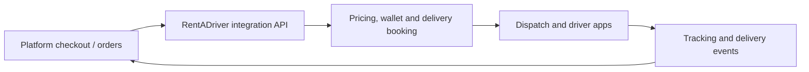

# Commerce integrations: high-level architecture

Reviewed: 10 September 2026.

Shopify, Wix and BigCommerce use embedded apps. Squarespace uses an external dashboard. WooCommerce combines a native WordPress plugin with RentADriver's external service.

**Embedded describes where the merchant sees the interface.** The delivery backend runs on RentADriver's servers for all five integrations.

This summary describes the repository implementation and platform architecture. It is not evidence of a fresh end-to-end installation test, marketplace approval or public availability.

## Integration comparison

| Integration | Where the merchant uses it | How our integration works |
| --- | --- | --- |
| **Shopify** | **Inside Shopify Admin**, with our page embedded in an iframe. | Shopify loads `https://rentadriver.ai/shopify`. App Bridge identifies the merchant; our API connects to the shop, receives order webhooks, books deliveries and writes fulfillment/tracking updates back. Checkout can request live delivery prices through Shopify's carrier-service interface, subject to platform eligibility and configuration. |
| **WooCommerce** | **Inside WordPress admin, plus an external dashboard.** | A PHP plugin is installed on the merchant's WordPress server. It adds the checkout shipping method and native admin screens for overview, orders, settings and rate testing. It calls our API for pricing and delivery operations. Store-issued API credentials and webhooks connect the two systems. The hosted `https://rentadriver.ai/woocommerce` dashboard and RentADriver console provide external access. |
| **Wix** | **Inside the Wix dashboard**, with our hosted page embedded. | Wix loads `https://rentadriver.ai/wix` and supplies a signed app instance identifying the site/user. Our API verifies access. A Shipping Rates extension calls our API during checkout; order webhooks drive booking, and fulfillment updates go back to Wix. |
| **Squarespace** | **External RentADriver dashboard**, at `https://rentadriver.ai/squarespace`. | The merchant authorizes access through Squarespace OAuth, then manages deliveries on our website. Our API receives order webhooks and writes tracking fulfillments back. Our implementation uses a merchant-created flat shipping option rather than live checkout quotes. |
| **BigCommerce** | **Inside the BigCommerce control panel**, with our hosted page embedded. | Single-click OAuth connects the store. A signed load callback opens `https://rentadriver.ai/bigcommerce` inside the platform. Order webhooks feed our booking service; shipments and tracking are written back. Live checkout quoting is implemented through Shipping Provider endpoints, but requires separate carrier registration and configuration. |

## Shared delivery flow

Checkout quoting, where supported, returns shipping options; it does not itself book a delivery. Booking follows a qualifying order event or an explicit merchant action, according to the store's settings.

The commerce platform owns the storefront, checkout and source order. RentADriver owns delivery pricing, wallet handling, booking, dispatch and tracking. Delivery events are translated back into each platform's supported fulfillment, shipment or order updates.

## Repository structure

**Shopify has its own dedicated UI and integration service:**

- Merchant UI: `apps/web/src/app/shopify/`
- API routes: `apps/api/src/routes/shopify.ts`
- Integration service: `apps/api/src/services/shopify.ts` (its own `shopify_*` tables, for now)
- Shopify adapter on the shared contract: `apps/api/src/services/commerce/shopify.ts` (every Shopify Admin API call) and
  `apps/api/src/lib/commerce/shopify.ts` (order, rate and webhook mappings). The Shopify service already goes through it.
- App configuration: `apps/integrations/shopify/shopify.app.toml`

Shopify storage is moving onto the shared commerce tables.

**Delivery-event sync is durable for every platform (migration 0108).** Delivery events are queued per order in
`commerce_sync_outbox` (Shopify: `shopify_sync_outbox`) and written to the platform by a leased worker
(`services/commerce-sync.ts`). The shared platforms write one note / shipment per event, so the worker replays every event
after the last one that reached the platform, in order, recording each; a retry never repeats a note. Merchant alert
emails go out once, from the bus.
Merchant sessions carry a `jti` and the store's `connection_generation`: sign-out revokes the session
(`commerce_revoked_sessions`) and `POST /v1/<platform>/app/disconnect` unlinks the account and ends every session.

**WooCommerce, Wix, Squarespace and BigCommerce share a commerce service**, with an adapter for each platform's authentication, orders, rates and tracking formats:

- Shared hosted UI: `apps/web/src/components/commerce-app.tsx`
- Platform pages: `apps/web/src/app/(commerce)/`
- Shared API routes: `apps/api/src/routes/commerce.ts`
- Shared integration service: `apps/api/src/services/commerce.ts`
- Platform adapters: `apps/api/src/services/commerce/`
- WordPress plugin: `apps/integrations/woocommerce/rentadriver-delivery/`

These integrations use the shared RentADriver web and API deployments; they do not each require a separate backend service. WooCommerce additionally runs its PHP plugin on the merchant's WordPress server.

## Installation and availability

None of these integrations is included in its commerce platform by default: merchants must install or connect RentADriver. An embedded interface is still a RentADriver-hosted application displayed within the platform's dashboard.

Configured credentials and a running API do not establish marketplace approval or validate an entire installation, checkout and delivery lifecycle. BigCommerce's Shipping Provider registration is also separate from its embedded app installation.

## Implementation references

- [Shopify implementation](./shopify/README.md)
- [WooCommerce implementation](./woocommerce/README.md)
- [Wix implementation](./wix/README.md)
- [Squarespace implementation](./squarespace/README.md)
- [BigCommerce implementation](./bigcommerce/README.md)

## Platform documentation

- [Shopify App Home and embedding](https://shopify.dev/docs/api/app-home/latest)
- [WooCommerce Shipping Method API](https://developer.woocommerce.com/docs/features/shipping/shipping-method-api)
- [Wix self-managed dashboard pages](https://dev.wix.com/docs/build-apps/develop-your-app/develop-a-self-managed-app/supported-extensions/dashboard-extensions/add-self-managed-dashboard-page-extensions)
- [Squarespace Developer Platform](https://developers.squarespace.com/)
- [BigCommerce embedded app UI](https://docs.bigcommerce.com/developer/docs/integrations/apps/guide/ui)
